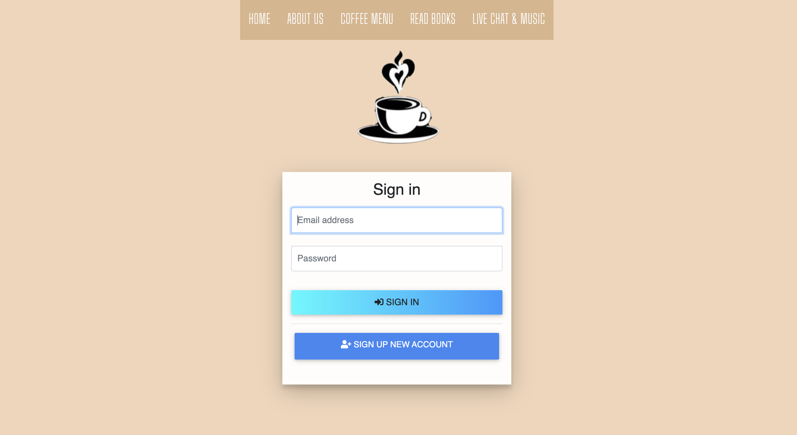

# Quarantine-Coffee
Welcome to Quarantine Cofffee! We're pleased to announce a new platform for a Virtual Coffee Shop!
What is a virtual coffee shop? With coffee shops and gathering places closing across the country, now more than ever we miss social interaction. The chance to be in a cozy and warm environment shared by others, chat with friends and strangers alike, to chat about which type of book is best. Our Quarantine Coffee team aims to create a space just like this, a space that you can chat, read, and connect, all without stepping outside your door. Bring your own coffee, pull up a chair and join a table. Have a chat, meet new people, invite your friends to join you, or just listen to others chat while you work.

## Getting Started
Click <a href="https://quarantine-coffee.herokuapp.com/">here</a> to start!

## Screen Shots



## Technologies used
- Node.js
- MySQL
- Handlebars - http://handlebarsjs.com/
- body-parser NPM Package - https://www.npmjs.com/package/inquirer
- express NPM Package - https://www.npmjs.com/package/express
- mysql NPM Package - https://www.npmjs.com/package/mysql
- handlebars NPM Package - https://www.npmjs.com/package/handlebars
- express-handlbars NPM Package - https://www.npmjs.com/package/express-handlebars
- NPM socket.io

## Installation
1. Clone the Git repository

   ```
   $ git clone <repo>
   ```
2. Navigate to the directory and install the dependencies 
   ```
   $ npm install
   ```

## Using the Application Locally
1. Create a MySQL database and run the following files to set up the schema
    * db/schema.sql
2. Configure the database connection settings in config/connection.js
3. Navigate to the repository folder and run server.js to start

   ```
   $ node server.js
   ```

4. Navigate to localhost:5000 in the browser

5. Enjoy!

